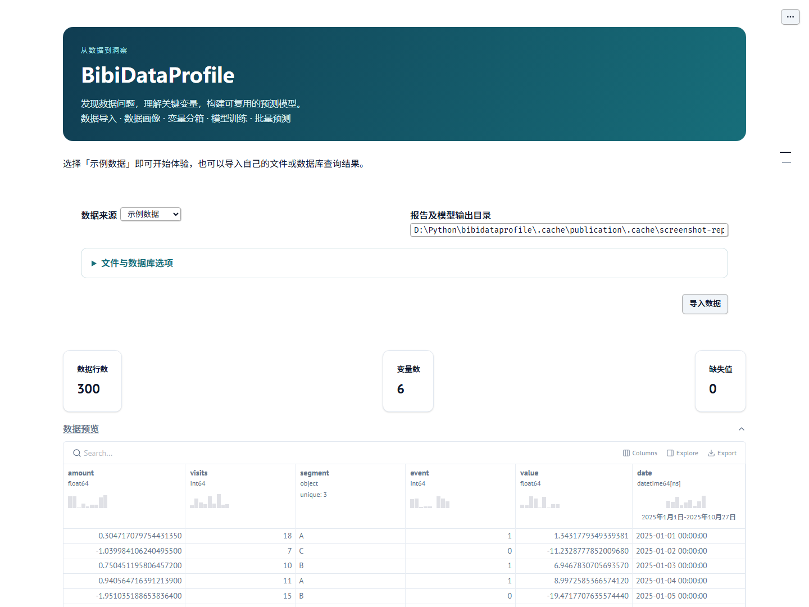
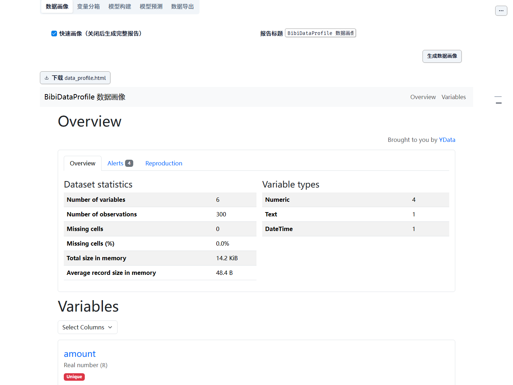
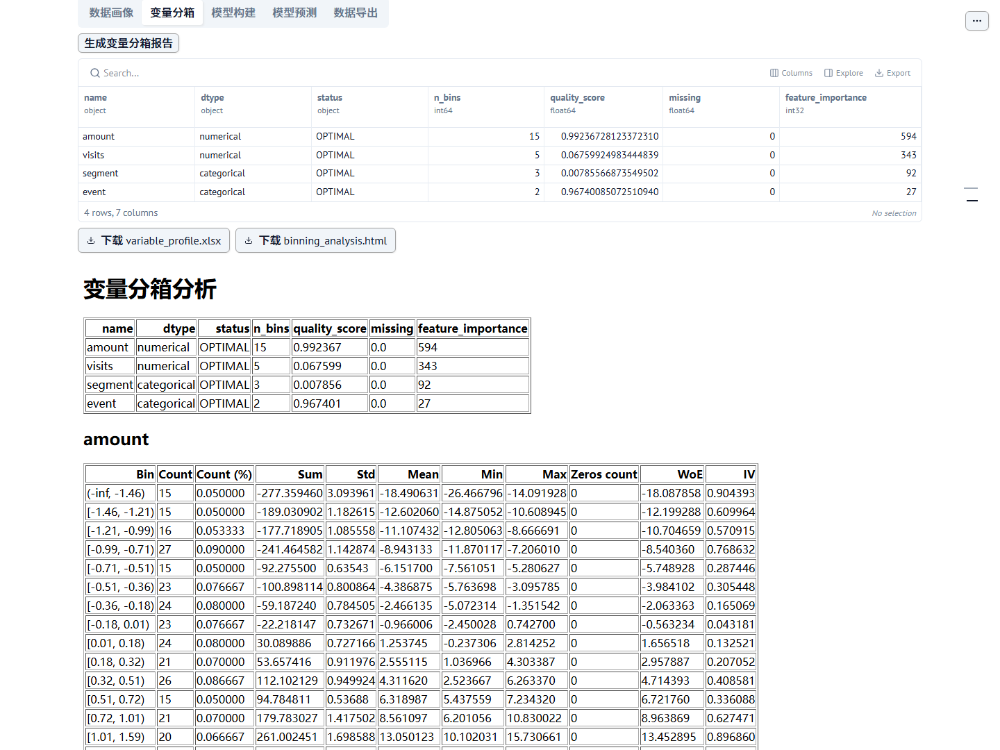
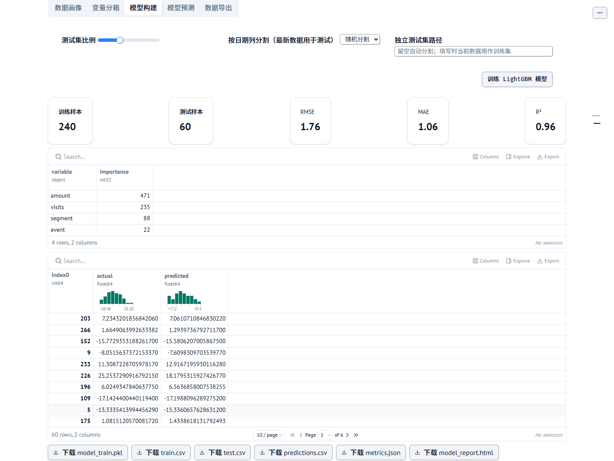
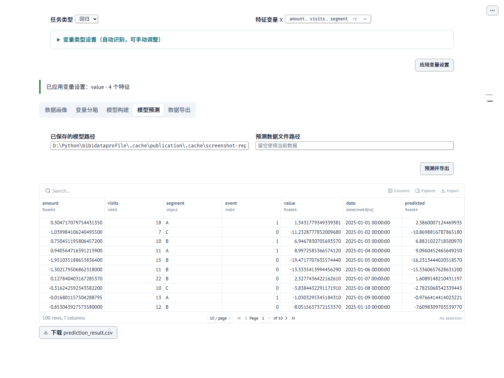

<div align="center">

# BibiDataProfile

### 从一份数据，到一份看得懂、用得上的分析

**数据画像 · 变量分箱 · 模型训练 · 批量预测**

[下载桌面版](https://github.com/bibiparrot/bibidataprofile/releases/latest) · [快速上手](#三步开始分析) · [反馈问题](https://github.com/bibiparrot/bibidataprofile/issues)


</div>



**BibiDataProfile 是一个把探索分析和预测建模放在一起的桌面数据工作台。** 导入表格或 SQL 查询结果，查看数据质量、理解变量与目标的关系，再训练和保存模型。报告、分箱表、评估指标与预测结果都能导出，方便继续研究、整理文档或分享分析结论。

不必先写一套分析脚本。内置示例数据，打开软件就能体验完整流程；自己的数据和模型在本机处理。

## 能帮你完成什么

| 你想解决的问题 | 在 BibiDataProfile 中可以做什么 | 得到的结果 |
| --- | --- | --- |
| 先了解一份陌生数据 | 预览数据、查看行数与变量数、统计缺失值，生成快速或完整画像 | 可单独打开的 HTML 数据报告 |
| 看清哪些变量更值得关注 | 选择目标与特征，进行变量分析和最优分箱 | Excel 分箱表、分箱图与变量重要性 |
| 建立一个可评估的预测模型 | 训练 LightGBM 回归或分类模型，选择测试集方式 | 评估指标、训练/测试数据、模型和预测结果 |
| 将已有模型用到新数据 | 加载保存的模型，选择新的预测文件 | 可下载的批量预测 CSV |
| 把分析接入后续工作 | 从文件或数据库读入数据，导出当前数据和分析产物 | CSV、HDF、HTML、Excel、JSON 与模型文件 |

## 值得一试的特色

### 一键数据画像，先找到数据问题

从「快速画像」开始概览数据，也可以生成完整报告进一步查看分布、缺失值和变量关系。在工作台里预览报告，或下载 HTML 单独打开。



### 变量分箱，让分析结果更容易解释

支持回归、二分类和多分类变量分析。数值和类别变量可以按类型处理，分箱结果同时提供图表与 Excel 表格，便于检查分组边界和各组目标表现。



多分类的类别特征提供重要性结果；分箱图目前支持多分类数值特征，以及回归、二分类的数值与类别特征。

### 按时间评估，让测试更贴近未来数据

除了随机分割，还可以按日期列把最新数据留作测试集，或直接指定独立测试文件。回归模型显示 RMSE、MAE、R²，分类模型显示准确率、F1，二分类另有 ROC AUC。变量重要性和预测结果与指标一起展示。



### 模型保存一次，后续数据继续使用

训练后的预处理与模型一起保存。加载模型即可对新数据批量预测，训练中未出现过的类别也能处理；不用重新整理一遍训练流程。



## 为什么用它

- **流程连贯**：导入、画像、分箱、建模、预测和导出在同一个工作台完成。
- **数据留在本机**：本地文件、报告和模型由本机处理，无需上传到分析云服务。
- **结果能带走**：报告可单独打开，表格可继续编辑，模型可重复使用。
- **兼顾数值与类别**：自动识别变量类型，也支持按分析需要手动调整。
- **入门门槛低**：内置示例数据，桌面版自动准备 Python 与分析环境，无需预先安装 Python。
- **平台选择齐全**：Windows 安装版/便携版，macOS Apple Silicon/Intel，Linux ARM64/x86_64。

## 下载适合你的版本

所有文件从本仓库的 [Releases](https://github.com/bibiparrot/bibidataprofile/releases/latest) 下载。以下为 **v0.2.3** 的直接入口：

| 系统与架构 | 推荐安装包 | 其他格式 |
| --- | --- | --- |
| Windows 10/11 · x86_64 | [EXE 安装版](https://github.com/bibiparrot/bibidataprofile/releases/download/v0.2.3/bibidataprofile-0.2.3-windows-x86_64_setup.exe) | [MSI 安装版](https://github.com/bibiparrot/bibidataprofile/releases/download/v0.2.3/bibidataprofile-0.2.3-windows-x86_64_setup.msi) · [便携 ZIP](https://github.com/bibiparrot/bibidataprofile/releases/download/v0.2.3/bibidataprofile-0.2.3-windows-x86_64_portable.zip) |
| macOS · Apple Silicon（M 系列） | [arm64 DMG](https://github.com/bibiparrot/bibidataprofile/releases/download/v0.2.3/bibidataprofile-0.2.3-arm64-macOS.dmg) | [PKG](https://github.com/bibiparrot/bibidataprofile/releases/download/v0.2.3/bibidataprofile-0.2.3-arm64-macOS.pkg) · [ZIP](https://github.com/bibiparrot/bibidataprofile/releases/download/v0.2.3/bibidataprofile-0.2.3-arm64-macOS.zip) |
| macOS · Intel | [x86_64 DMG](https://github.com/bibiparrot/bibidataprofile/releases/download/v0.2.3/bibidataprofile-0.2.3-x86_64-macOS.dmg) | [PKG](https://github.com/bibiparrot/bibidataprofile/releases/download/v0.2.3/bibidataprofile-0.2.3-x86_64-macOS.pkg) · [ZIP](https://github.com/bibiparrot/bibidataprofile/releases/download/v0.2.3/bibidataprofile-0.2.3-x86_64-macOS.zip) |
| Linux · aarch64 / ARM64 | [AppImage](https://github.com/bibiparrot/bibidataprofile/releases/download/v0.2.3/bibidataprofile-0.2.3-linux-aarch64.AppImage) | [RPM](https://github.com/bibiparrot/bibidataprofile/releases/download/v0.2.3/bibidataprofile-0.2.3-linux-aarch64.rpm) · [tar.gz](https://github.com/bibiparrot/bibidataprofile/releases/download/v0.2.3/bibidataprofile-0.2.3-linux-aarch64.tar.gz) |
| Linux · x86_64 | [AppImage](https://github.com/bibiparrot/bibidataprofile/releases/download/v0.2.3/bibidataprofile-0.2.3-linux-x86_64.AppImage) | [RPM](https://github.com/bibiparrot/bibidataprofile/releases/download/v0.2.3/bibidataprofile-0.2.3-linux-x86_64.rpm) · [tar.gz](https://github.com/bibiparrot/bibidataprofile/releases/download/v0.2.3/bibidataprofile-0.2.3-linux-x86_64.tar.gz) |

安装版按提示安装；Windows 便携版解压后运行 `bibidataprofile.exe`，并保留同目录的 `uv.exe`。macOS ZIP 解压后打开 `.app`；Linux tar.gz 解压后运行其中的 `AppRun`，AppImage 需要赋予执行权限。

首次启动需要联网下载 Python 3.12 和分析依赖，完成后可离线分析本地文件。Windows 需要 WebView2。Linux 需要图形桌面和 OpenMP 运行库（Debian/Ubuntu 为 `libgomp1`）；x86_64/ARM64 包以 Ubuntu 22.04 为构建基线。macOS 包已包含 OpenMP，但尚未配置开发者签名与公证。

## 三步开始分析

1. **导入数据**：先试「示例数据」；自己的文件或 SQL 连接在「文件与数据库选项」中填写。支持 CSV、TSV、JSON、XML、Excel 和 HDF。
2. **选择分析目标**：指定目标变量 Y、任务类型和特征 X，点击「应用变量设置」。自动识别的类型可展开调整。
3. **生成需要的结果**：在对应标签页生成画像、分箱或训练模型；完成后预览、下载，再用保存的模型继续预测。

报告与模型默认保存到用户目录下的 `.bibidataprofile/reports/`，也可以在导入时指定自己的输出目录。

<details>
<summary>已有 Python 3.12？也可以直接启动控制面板</summary>

从 Release 下载 wheel 后安装：

```bash
python -m pip install bibidataprofile-0.2.3-py3-none-any.whl
python -m bibidataprofile
```

</details>

## 项目与反馈

遇到问题或有功能建议，欢迎提交 [Issue](https://github.com/bibiparrot/bibidataprofile/issues)。说明操作步骤、文件格式和系统版本，可以帮助更快定位问题。

界面由 [marimo](https://marimo.io/) 驱动，桌面发布基于 [bibimapy](https://github.com/bibiparrot/bibimapy)；分析使用 YData Profiling、OptBinning 和 LightGBM。截图均由当前 marimo 控制面板使用内置示例数据实际生成，展示的是桌面版与 Python 版共用的分析界面。

个人、非商业使用免费，完整条款见 [软件许可](license.txt)。构建与维护说明见 [发布文档](docs/release.md)，验证范围见 [验证记录](docs/validation.md)。
